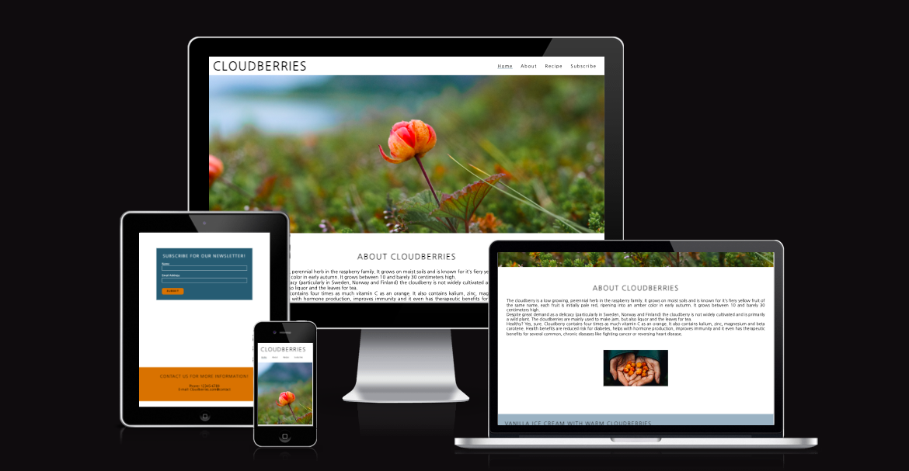
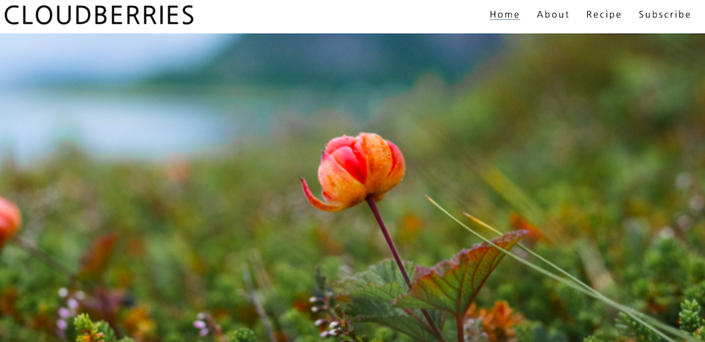
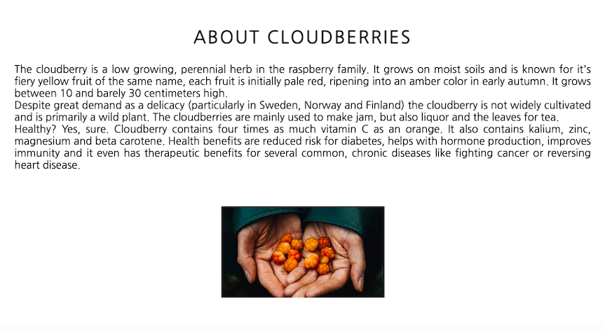
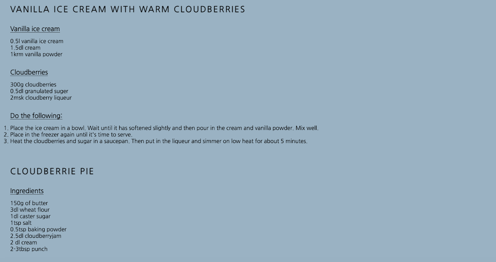
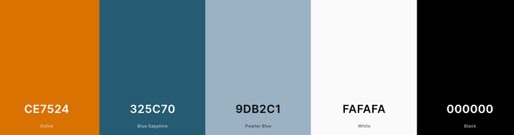
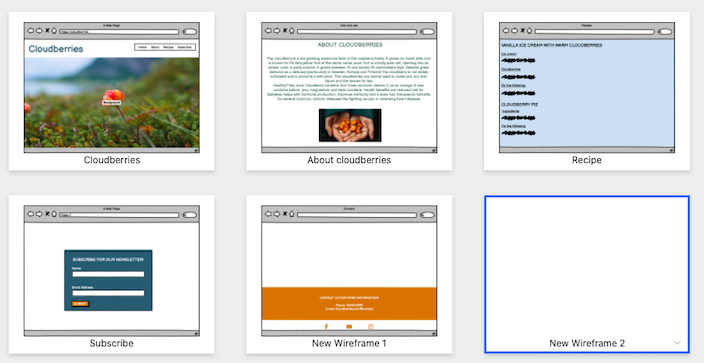
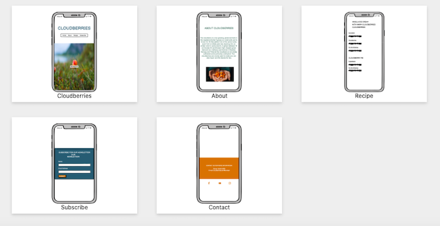

# CLOUDBERRIES

### A site about Cloudberries, where you get information about the berries, to get inspiration to both pick them and eat them. Users of the website will get two of the best recipes of how to use cloudberries.   If the reader wants more information about cloudberries and local places, where you can meet up to pick the berries in different parts of the world, you can sign up for our newsletter.   If you have any questions, there is information on how to contact us.   The aim of the project is to build a responsive website allowing visitors to view it whatever device they have.

## Pages and Features

### Existing Features

- __Navigation Bar__

  - Featured on the first page to allow easy navigation, the navigation bar includes links to the Logo, Home page, About page, Recipe page and Subscribe page.

- __The landing page image__

  - The landing includes a photograph that show the user a clear picture how the berry looks like and what the site is about.
  - This section introduces the user to to grab their attention to both picking and eating the berry.

- __About Cloudberries__

  - Information about cloudberries, where the berry grows in the world and how you can use it in different ways. And some information about the health benefits of the cloudberries. 
  - That readers who have specific health problems that the berries can help heal.

- __Recipe__

  - This section will allow the user to see two of the best recipes of what you can do with cloudberries.

  

### The recipes can be found here:
 (https://www.koket.se/varma-hjortron-med-glass-och-havrecrunch) (https://www.koket.se/sandra_dahlberg/efterratter_och_godis/frukt_och_bar/hjortronpaj)

__Subscribe__

  - This section will allow the user to subscribe for the cloudberries newsletter. To get more information about where you can meet up to go out and pick the berries together. Read interviews about people who experienced health effects from eating the berries, etc. The user will be asked to submit their full name and email address. 

  

  __Contact__

  - The contact information will provide the user with information if you have questions that you want answers to quickly. 

  

- __The Footer__ 

  - The footer section includes links to the relevant social media sites for Cloudberries. The links will open to a new tab to allow easy navigation for the user. 
  - The footer is valuable to the user as it encourages them to keep connected via social media.

## User Experience and Design
---

- Overarching design and Colourscheme

  - I picked my designs/color schemes from the cloudberry frontpage, this felt most appropriate to make a nice structure throughout the page.
  - Sign up for our newsletter was colored to make it stand out a bit against the rest of the page, maybe it makes curious users want to fill out the form to get updated information every now and then.

### Colours

  - I been trying to get good visibility using the contrast of the different colors so that the visually impaired can easily see everything that is written.
  - I have also tried to make my page look happy by mixing the colors from my palette in a tasteful way.
  
  

  I did my colorscheme in https://coolors.co/

  ### Fonts

  - All my fonts are Nanum gothic, Arial;

  ### Content 

- The text for the Home page was taken from Wikipedia with the search of "Cloudberries" and "Health".
- Information of the cloudberries was taken from two different pages.

(https://en.wikipedia.org/wiki/Rubus_chamaemorus) 
(https://thebarentsobserver.com/en/arctic/2017/08/all-you-didnt-know-about-cloudberry-healthy-gold-arctic)

- The icons in the footer were taken from [Font Awesome](https://fontawesome.com/)

### The links to my icons if the user wants to read more on different pages about cloudberries:

- https://www.facebook.com/  
- https://www.youtube.com/  
- https://www.instagram.com/  

### Media

- The photos used on the home and about page was taken from Google.

- https://visitumea.se/sites/cb_umea/files/styles/slide_large/public/Hjortron%201.%20Foto%20Visit%20Ume%C3%A5.%20jpg.jpg?h=e5aec6c8&itok=nAnz3Qvl
- https://chopchop.se/wp-content/uploads/2022/09/Screenshot-2022-09-01-at-10.01.48-796x480.png

### Wireframes

- Wireframes were created for mobile and desktop.
- to get an overview of how the page will look when it is finished.

### Missings links

- The submit button links you back to the homepage, since the right direction doesen't exist today.

### Features Left to Implement

- Another feature idea is to make a schedule of where the viewers can meet in the world to meet up and pick the berries together. To add more pictures of the recipe side and add icons to make the page more appealing, for example so you can easily see how many people the recipe is for.

## Testing 

- I used lighthouse test at https://web.dev/measure and came up with the following scores:
- The resault can be found here: (https://web.dev/measure/?url=https%3A%2F%2Fhannaberggren.github.io%2FCLOUDBERRIES%2F)

### Validator Testing 
- <a href = "https://jigsaw.w3.org/css-validator/validator?uri=+https%3A%2F%2Fhannaberggren.github.io%2FCLOUDBERRIES%2F&profile=css3svg&usermedium=all&warning=1&vextwarning=&lang=sv">Jigsaw Validator results</a>
 - <a href = "https://validator.w3.org/nu/?doc=https%3A%2F%2Fhannaberggren.github.io%2FCLOUDBERRIES%2F">W3C validator results</a> 

### Fixed Bugs
- I fixed two errors in validator.w3 "No p element in scope and p end tag seen". I just removed that.
 The second error was "Stray end tag div". All I had to do was to remove the space between my h2 and h3 heading.

## Deployment 

- The site was deployed to GitHub pages. The steps to deploy are as follows: 
  - In the GitHub repository, navigate to the Settings tab 
  - From the source section drop-down menu, select the Master Branch
  - Once the master branch has been selected, the page will be automatically refreshed with a detailed ribbon display to indicate the successful deployment. 

The live link can be found here - https://hannaberggren.github.io/CLOUDBERRIES/

## Acknowledgements

The site was completed as a Portfolio 1 Project piece for the Full Stack Software Developer (e-Commerce) Diploma at the Code Institute. I would like to thank my mentor Precious Ijege, Slack community, and all at the Code Institute for their help and support.

Hanna Berggren 2022.

